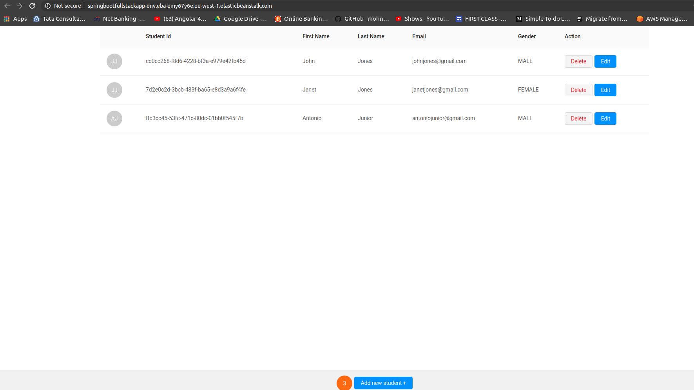

# aws-spring-boot-react-fullstack

This is a standard student GUI Application.

This application springboot as backend , React.js as frontend and PostgreSQL as backend.

This application is deployed in AWS Beanstalk and communicates to the database , created in RDS.

